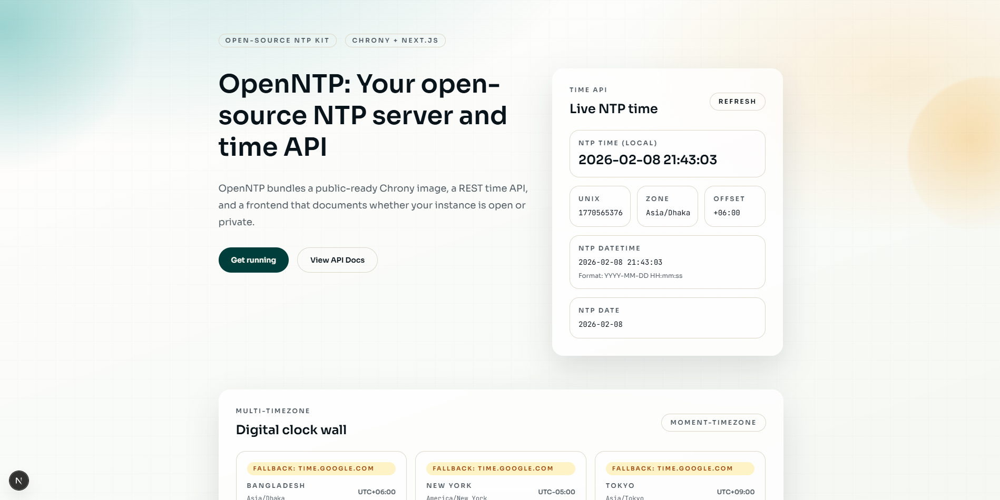

# OpenNTP

OpenNTP ships a single Docker container that runs Chrony (NTP) and a Next.js UI. Every API response is NTP-backed with a fallback to Google NTP if the local Chrony server is unavailable.



## What is included

- Chrony configuration in [chrony/](chrony/)
- Next.js UI with multi-timezone digital clocks
- NTP-backed REST APIs and Swagger docs

## Quick start (single container)

Build and run the OpenNTP service:

```bash
docker compose up -d --build
```

Default ports:

- UDP/123 for NTP
- HTTP/3000 for the UI and APIs

## Set up your own NTP server

OpenNTP uses Chrony inside the container. To make it your own:

1) Edit the upstream sources and access rules in [chrony/chrony.conf](chrony/chrony.conf).
2) If you want a private server, remove the UDP/123 mapping or restrict it with a firewall.
3) Start the stack with `docker compose up -d --build`.
4) Point your clients to your host on UDP/123.

Example client check:

```bash
ntpdate -q <your-server-ip>
```

## Configuration

Frontend (UI only):

```bash
NEXT_PUBLIC_NTP_EXPOSED=true|false
NEXT_PUBLIC_NTP_HOST=ntp.example.com
NEXT_PUBLIC_TIMEZONES=Bangladesh|Asia/Dhaka, New York|America/New_York
```

NTP sources:

```bash
NTP_SERVER_HOST=127.0.0.1
NTP_FALLBACK_HOST=time.google.com
NTP_TIMEOUT_MS=2500
```

The UI flags only change the display. Exposure is still controlled by Docker Compose and your firewall rules.

## API endpoints

- `GET /api/time` - NTP-backed time payload
- `GET /api/timezones` - every Moment timezone with NTP time
- `GET /api/health` - uptime, Chrony tracking, NTP metadata
- `GET /api/openapi` - OpenAPI spec
- `GET /docs` - Swagger UI

Example response for `GET /api/time`:

```json
{
	"nowIso": "2026-02-08T18:04:01.528Z",
	"unix": 1770573841,
	"timezone": "America/New_York",
	"offsetMinutes": -300,
	"source": "ntp",
	"ntp": {
		"host": "127.0.0.1",
		"source": "local",
		"warning": null
	}
}
```

## Local UI dev

```bash
pnpm install
pnpm run dev
```

Open [http://localhost:3000](http://localhost:3000).
